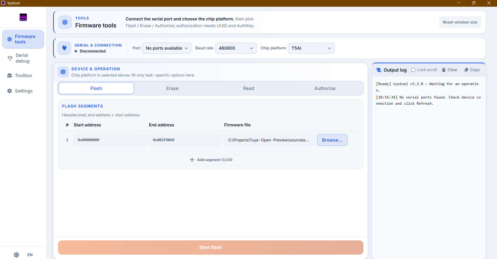

# Build & Flash

## Prerequisites

- TuyaOpen SDK installed (IDE-managed). On the dev machine this lives under the
  IDE installation (e.g. `<SDK_ROOT>` = the TuyaOpenSDK folder the IDE creates).
- Python 3.12 + GNU make from the SDK `.tools` / `.venv`.
- Verify once: `tos.py check`.

## Build

```powershell
cd source/embedded

# Windows: fix the toolchain codepage bug — always set these:
$env:PYTHONUTF8 = "1"
$env:PYTHONIOENCODING = "utf-8"

# PATH must include the SDK venv + tools (the IDE does this; in a plain shell:)
# Replace <SDK_ROOT> with your TuyaOpenSDK path.
$env:PATH = "<SDK_ROOT>\.venv\Scripts;" +
            "<SDK_ROOT>\.tools\python\3.12.13\cpython-3.12.13-windows-x86_64-none;" +
            "<SDK_ROOT>\.tools\make\4.4.1;" + $env:PATH

python "<SDK_ROOT>\tos.py" build
```

**Output** → `source/embedded/dist/Tuya-Open-Preview_0.1.0/`:

| File | Purpose |
|------|---------|
| `Tuya-Open-Preview_QIO_0.1.0.bin` | full flash image (use this) |
| `Tuya-Open-Preview_UA_0.1.0.bin` | user app partition |
| `Tuya-Open-Preview_UG_0.1.0.bin` | upgrade image |

The published bins are tracked in `dist/` so anyone can flash without rebuilding.

### Build gotchas

- **A2 – charmap bug**: without `PYTHONUTF8`, packaging fails with
  `'charmap' codec can't encode character …`. The env vars above fix it.
- First build takes a while (SDK components). Incremental builds are fast.
- `tos.py build` must run from `source/embedded` (where `app_default.config` lives).

## Flash

> **Critical**: T5AI-Core has **no auto-reset circuit**. You must
> press the board's **RST button during the handshake window**, or power-cycle,
> or the tool hangs waiting for the device.

### GUI (recommended — verified working)

1. Open tyutool **GUI** (from the SDK tools).
2. Port: **COM4 @ 460800** (observed working pair; see ports note below).
3. Select `Tuya-Open-Preview_QIO_0.1.0.bin`.
4. Click flash → **immediately press RST** on the board.
5. Wait ~1m30s for `Verification passed. Flash succeeded.`

<div align="center">
  
</div>

### CLI

```powershell
& "<SDK_ROOT>\tools\tyutool\tyutool_cli.exe" `
    --plain write -d t5 -p COM3 -f source/embedded/dist/Tuya-Open-Preview_0.1.0/Tuya-Open-Preview_QIO_0.1.0.bin
```

(CLI @921600; again — press **RST during the handshake**.)

### Ports note

The two USB-serial roles are **unstable**: one port is the log port
(USB-Enhanced-SERIAL-B) and the other the flash port (USB-Enhanced-SERIAL-A), but
the roles have swapped between sessions. If flash times out, swap ports or check
Device Manager.

## After flashing

1. **Re-pair if unbound**: a full reflash can silently un-bind the device from
   your account (`Reset id:…`, `unactive`, `GATEWAY_NOT_EXISTS`). Re-add the device
   in the Tuya app (module credentials are pre-burned, no manual entry needed).
2. **Set conversation mode to `free`**: the device boots in `hold` until the app
   writes DP 9 = `free`.
3. Check the log console (`PR_*` output) for clean boot:
   `app init ok`, cloud `mqtt connected`, no `Cmd Parse Fail`.

## Monitoring device logs

Serial monitor on the **log port** (usually COM3 @ 460800 or as detected):

```powershell
& "<SDK_ROOT>\tools\tyutool\tyutool_cli.exe" --plain monitor -p COM3
```

Or use the TuyaOpen IDE's built-in monitor. Logs use `PR_DEBUG/PR_NOTICE/PR_WARN/PR_ERR`.