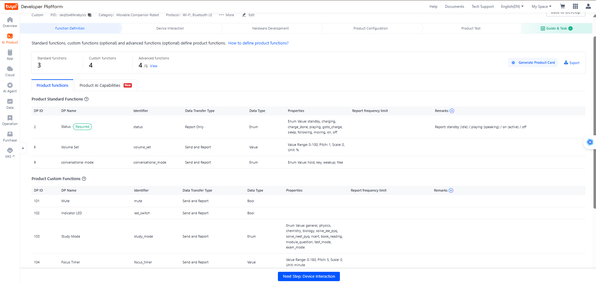
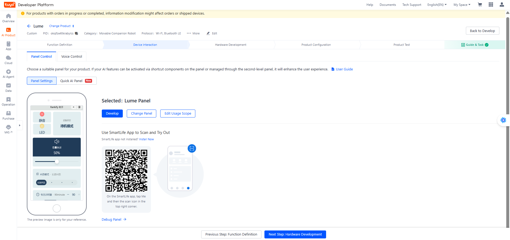
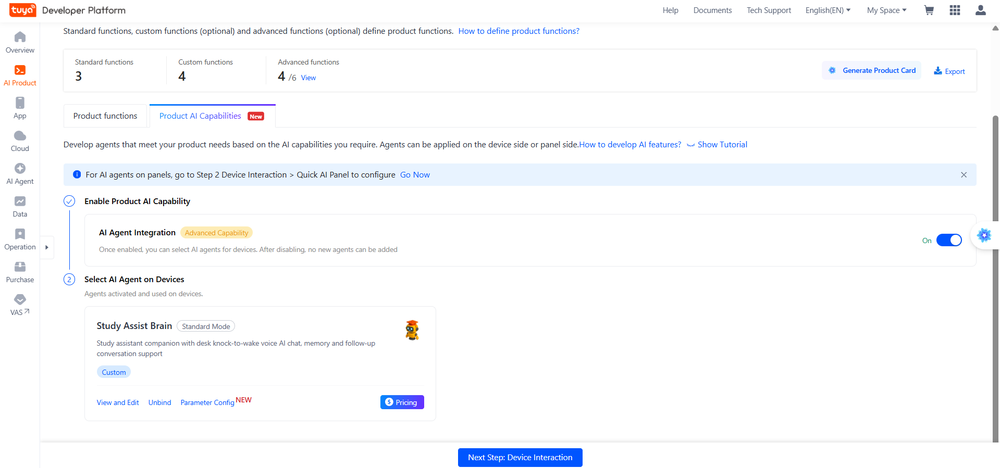

# DP Schema (Product: Rankify Assist)

Product PID `okqfzw6tkrabylcs`. The table below is the **source of truth** for the
panel and firmware; generated mirrors live in:

- Firmware: `source/embedded/include/tuya_dp_profile.h` (`// DP-HASH: …`)
- Panel: `source/miniapp/src/devices/schema.ts`

Regenerate after any product change: `tuyaopen dp generate --target embedded,miniapp`
(never hand-edit the generated files).

  

## Active DPs

| ID | Code | Type | Mode | Bounds / Options | Meaning |
|----|------|------|------|------------------|---------|
| 2 | `status` | enum | ro | `standby` `charging` `charge_done` `playing` `goto_charge` `sleep` `following` `moving` `on` `off` | device status |
| 6 | `volume_set` | value | rw | 0–100, step 1 | speaker volume % |
| 9 | `conversational_mode` | enum | rw | `hold` `key` `weakup` `free` | chat activation mode |
| 101 | `mute` | bool | rw | `true`/`false` | mic muted (stops `ai_audio_input`) |
| 102 | `led_switch` | bool | rw | `true`/`false` | LED override on/off |
| 103 | `study_mode` | enum | rw | `general` `physics` `chemistry` `biology` `solve_jee_pyq` `solve_neet_pyq` `ncert` `book_reading` `module_question` `test_mode` `exam_mode` | active study subject/mode |
| 104 | `focus_timer` | value | rw | 0–180, step 5 (minutes) | study focus countdown |

## Firmware behavior per DP

### DP 2 `status` (ro)
Reported by the cloud/AI layer; firmware consumes it for state transitions.

### DP 6 `volume_set` (rw)
- Received → `ai_audio_player_set_volume` (and stored for boot restore).
- Local changes (e.g. from AI layer) are uploaded via `ai_audio_volume_upload()`.

### DP 9 `conversational_mode` (rw)
- `hold` — chat only while button held.
- `key` — chat toggled by button press.
- `weakup` — chat activated by wake word (on-device KWS).
- `free` — always listening / free chat.
- Persisted in KV so the mode survives reboots.
- **Note:** device boots with saved value; if never set, it boots `hold`-like (0).

### DP 101 `mute` (rw)
- `true` → `ai_audio_input_stop()` (mic off, knock detector gets no stream).
- `false` → `ai_audio_input_start()`.
- Muting also silences double-knock wake (by design — mic is off).

### DP 102 `led_switch` (rw)
- User override: forced ON or OFF beats AI-driven LED states.
- Override persists and is re-applied after boot once the LED handle is open.

### DP 103 `study_mode` (rw)
- Selects the agent's study focus (injected into chat context on change).

### DP 104 `focus_timer` (rw)
- `0` → cancel (or idle report when countdown finishes).
- `1–180` (step 5) → start countdown, play start chime, inject context into agent.
- On expiry: report `{"104":0}`, play wakeup alert, inject "timer ended — ask
  about study goal" into the agent. See [AI Agent](agent.md) for the exact strings.

## Non-schema DP (do not use)

- **DP 207** — used by the cloud **timer BIC function** (`"code":"timer"`, selected
  on this product). Cloud-created timers fire `dp207` instructions which the
  firmware rejects (`DP ID 207 Invalid`). **Never rely on cloud timers**; the agent
  is configured to refuse creating them.

## Product cloud functions (BIC)

From product snapshot `dpSchema.uiConfig.bic[]`:

| Function | Selected | Notes |
|----------|----------|-------|
| `timer` | yes | fires DP 207 — **unsupported** by schema (see above) |

All other advanced functions (e.g. AI-related) are unselected on this product.

## Panel bindings (summary)

| Panel component | DP | Notes |
|-----------------|----|-------|
| Volume slider | 6 | default 50 % |
| Conversation mode | 9 | 4 options |
| Focus timer | 104 | presets 25 / 45 / 90, step 5, max 180 |
| Mute (toggle) | 101 | Target = **Not** (toggle) |
| LED indicator | 102 | default off |
| Study mode | 103 | same enum as firmware |

  

  

Full panel guide: [Panel Setup](panel-setup.md)