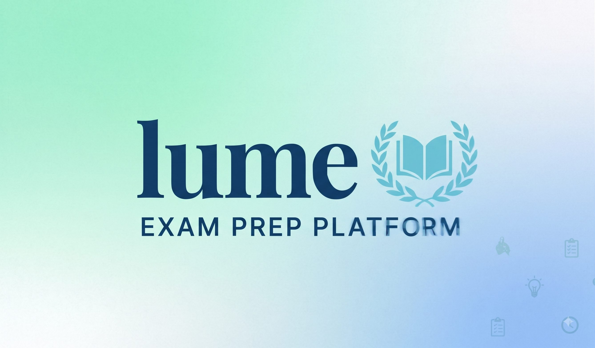

# Lume Study Assistant

**Voice-first AI study companion for exam prep** — built on TuyaOpen (T5AI chip,
T5AI-Core board). Talk hands-free, run a study focus timer from the app, and get
short, honest, voice-friendly answers. No screen required.

<div align="center">
  
</div>

## ✨ Features

- 🎙️ **Voice AI chat** — wake with the physical button **or a desk double-knock**;
  ask anything, hear a short spoken answer (Hinglish / Hindi / English).
- ⏱️ **Study focus timer** — 5–180 minutes, set from the panel app. Chime + AI
  check-in ("Did you finish your goal?") when it ends.
- 💬 **Conversation modes** — `hold` / `key` / `weakup` / `free`, persisted on device.
- 🔇 **Mute / LED / volume / study mode** — all controllable from the app.
- 🧠 **Exam-prep brain** — syllabus-first answers, remembers the student's name &
  goal, strictly refuses to create cloud timers.
- 🚫 **No screen, no wires** — everything is voice + app.

## 🖥️ Hardware

| | |
|---|---|
| Chip | T5AI (Beken-class Wi-Fi + AI audio SoC) |
| Board | Tuya T5AI-Core (`TUYA_T5AI_CORE`) |
| Audio | On-board mic + speaker |
| Input | `ai_chat_button` + desk double-knock detection |
| Output | On-board indicator LED |
| Network | Wi-Fi (provisioned via Tuya app) |

## 📁 Repository layout

```
├── docs/                 # this docs site (markdown — GitHub Pages renders it)
├── source/
│   ├── embedded/         # firmware (C) — build with tos.py
│   │   ├── include/      # tuya_config.h, tuya_dp_profile.h, app_*.h
│   │   └── src/          # tuya_app_main.c, app_chat_bot.c, app_dp_ctrl.c,
│   │                     # app_knock.c, reset_netcfg.c
│   └── miniapp/          # Ray mini-app panel (TypeScript)
├── dist/                 # published firmware bins (QIO / UA / UG)
├── LICENSE               # MIT
└── README.md
```

## 📖 Documentation

| Page | What it covers |
|------|----------------|
| [Architecture](architecture.md) | chip/board, firmware modules, RTOS, audio & AI flow |
| [Configuration](configuration.md) | project files, Kconfig, `tuya_config.h`, agent skill files |
| [DP Schema](dp-schema.md) | every DP: ID, code, type, mode, bounds, firmware mapping + screenshots |
| [AI Agent](agent.md) | the "Lume" Brain prompt, timer-injection contract, publishing |
| [Agent Prompt](agent-prompt.md) | paste-ready prompt text |
| [Panel Setup](panel-setup.md) | visual panel + Ray mini-app, mute toggle config + screenshots |
| [Build & Flash](build-flash.md) | `tos.py` build, tyutool flash, RST gotcha, ports |

## 🚀 Quick start

```bash
# 1. Build (Windows: set PYTHONUTF8=1 first — see build-flash.md)
cd source/embedded && tos.py build

# 2. Flash (press RST during handshake! no auto-reset circuit)
tyutool --plain write -d t5 -p COM4 -f dist/Tuya-Open-Preview_0.1.0/Tuya-Open-Preview_QIO_0.1.0.bin

# 3. Authorize (module credentials were pre-burned; re-pair after reflash)
#    via tyutool or the TuyaOpen IDE

# 4. Panel + agent — see Panel Setup and AI Agent pages
```

Product PID: `okqfzw6tkrabylcs` · Agent (Brain): `aipt_fvjuqr11yk8w`